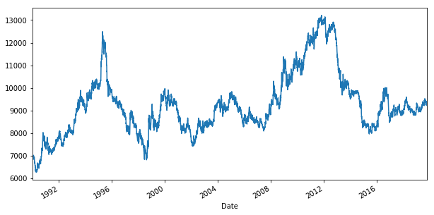
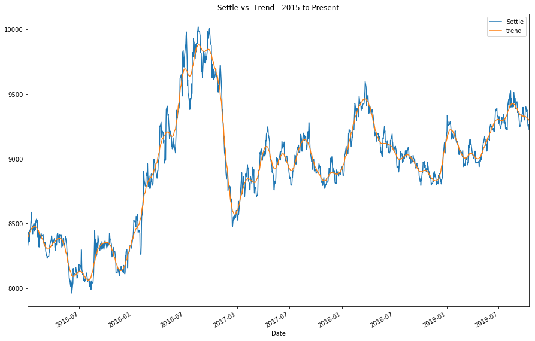
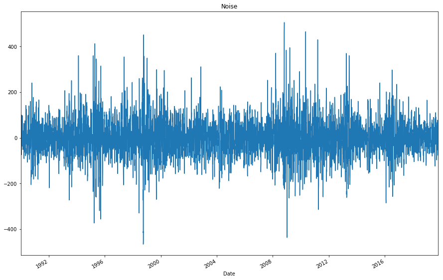
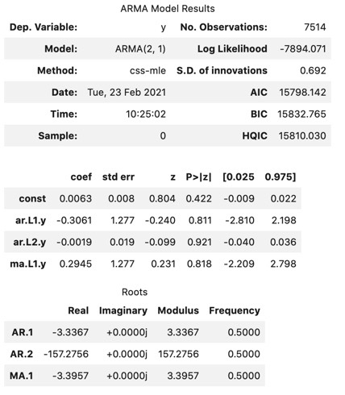
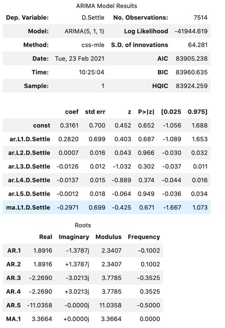
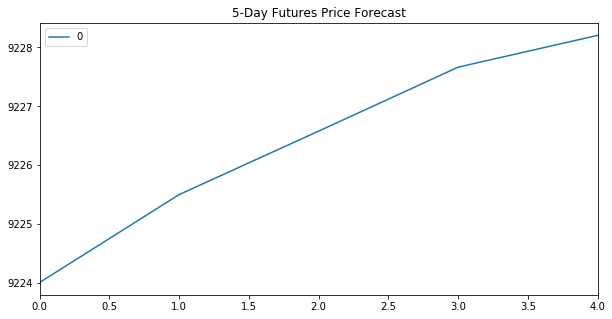
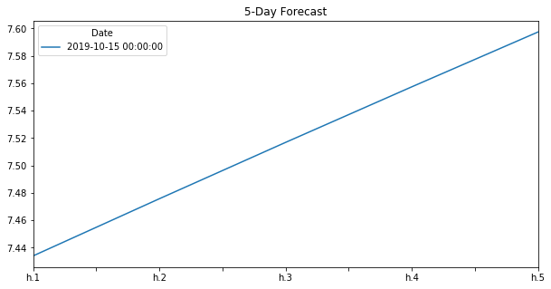
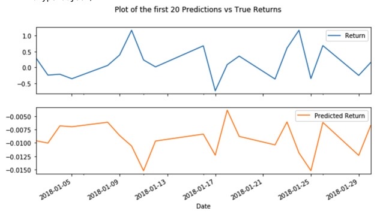
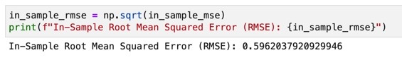

# Forecasting the Value of the Japenese Yen vs USD  
#### In this notebook we will load historical Dollar-Yen exchange rate futures data and apply time series analysis and modeling to determine whether there is any predictable behaviour. Refers to the .ipynb file for detailed code. The below will showcase the visualizations, plots and overall conclusions. 

#### Return Forecasting: Initial Time-Series Plotting

##### Based on the graph, it appears there is a general trend upward and there may be some seasonality over a period of 16 years (1996 to 2012). 

### Decomposition Using Hodrick-Prescott Filter 
#### We will now decompose the settle price into a trend and noise. 

### Forecasting Returns using an ARMA Model 
####  Using futures Settle Returns we will now estimate an ARMA model, determine if the model is a good fit for the returns data and plot the 5-day forecast.

#### Based on the model summary results, we have a p-value = 0.811, which is >0.05 indicating that this model is not a good fit. 

### Forecasting the Settle Price using an ARIMA Model
#### Using the raw Yen settle price we will estimate an ARIMA model, determine if the model is a good fit and plot the 5-day forecast.

#### Based on the ARIMA model summary results, we have a p-value = 0.687, which is >0.05 indicating that this model is not a good fit. 

#### Now we will look at a 5-Day Futures Price forecast below. 

### Volatility Forecasting with GARCH 
#### Now we will forecast the near-term volatility of Japenese Yen futures returns which can help us to predict volatility for trading in derivatives or to quantity our maximum loss. Creating a GARCH model, we will determine if the model is a good fit for the data and plot the 5-day forecast of the volatility.

#### Based on the GARCH model summary results, we have a p-value <0.05 indicating that this model is a good fit. 

#### Now we will look at a plot of the 5-Day forecast below: 

### Conclusions
#### 1. Based on the above time series analyses, I would not buy yen now. From the model output results for both the ARMA and the ARIMA models,  their p-values are greater than 0.05 therefore, the coefficient for the autoregressive term is not statistically significant and these models do not appear to be a good fit for our data. 
#### 2. In addition, the output of the GARCH Forecast Model shows an upward trend indicating that the exchange rate risk of the yen is expected to increase. Personally, I would not be comfortable with this level of risk. 
#### 3. Based on the model evaluations, I would not feel confident solely using these models for trading. 

## Regression Analysis: Seasonal Effects with Sklearn Linear Regression
#### In this notebook, a Scikit-Learn linear regression model will be built to predict Yen futures returns with lagged Yen futures returns and categorical seasonal effects. We will also determine if the model performs better or worse on out-of-sample data vs in-sample data. 

## Linear Regression Model - Training Data 

#### Using the returns data, lagged returns data and train/test split we can look at the plot below for the first 20 predicted returns vs true returns to evaluate our model: 

### In-Sample vs Out-of-Sample Model Performance Evaluation 
#### In order to evaluate models using in-sample data (X_train and y_train) vs out-of-sample data (X_test and y_test) a calculation of their mean squared errors was computed. Their results are:

 

### Conclusions
#### The model performs better with out-of-sample data (training data) because it has a RMSE value of .415 as opposed to the RMSE of .596 for the in-sample data.

